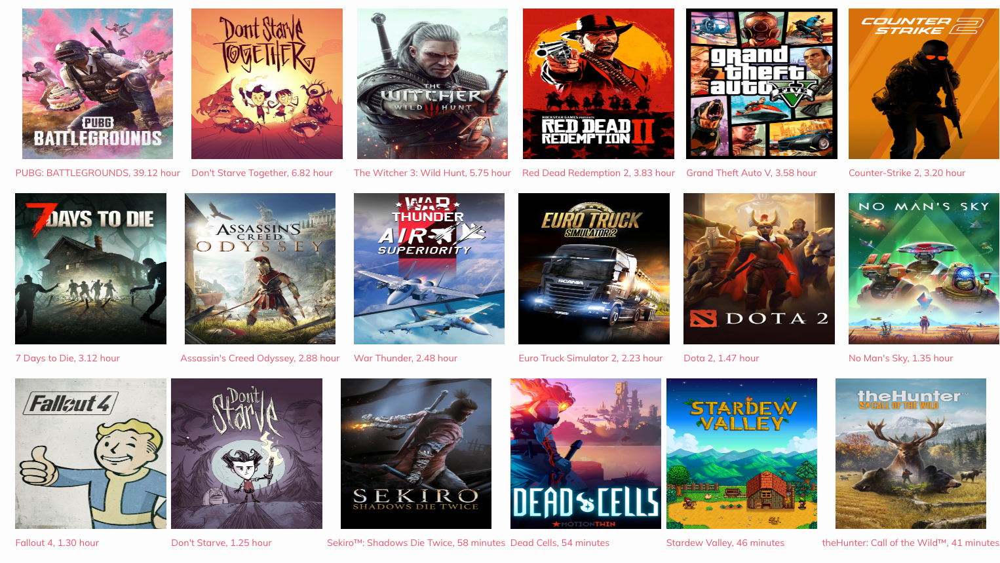

# hexo-steamgames-page

a hexo plugin for collect your steam games into custom page.



# Usage

## install using npm or yarn

```shell
# yarn
yarn add hexo-steamgames-page
# npm
npm install hexo-steamgames-page
```

## plugin configuration

add `steam` section on _config.yaml

```yaml
steam:
  enable: true # enable or disable plugin
  appKey: "xxx" # steam api key
  steamId: "xxx" # your steam id
```

after run `hexo g` will auto generate page `/steam/index.html`